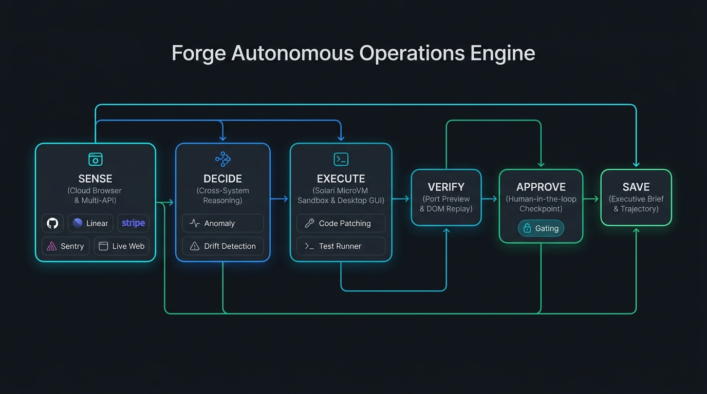
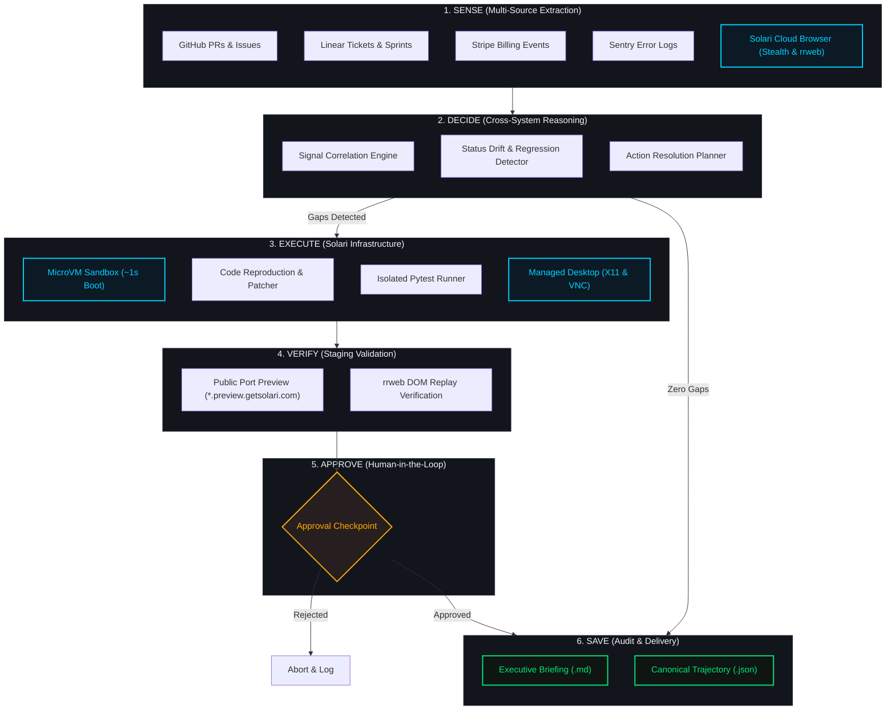

# Forge Autonomous Operations Engine (Powered by Solari)

An autonomous cross-stack intelligence and remediation worker built on LangGraph and Solari infrastructure.

It senses cross-tool discrepancies across GitHub, Linear, Stripe, Sentry, and live web portals, isolates root causes in isolated microVM sandboxes, verifies fixes against live port previews and session recordings, and delivers verified briefs with human-in-the-loop approval.

---

## Contents

- [The Core Problem](#the-core-problem)
- [System Architecture](#system-architecture)
- [Solari Infrastructure Integration](#solari-infrastructure-integration)
- [Evaluation and Benchmark Results](#evaluation-and-benchmark-results)
- [Reproducibility Guide](#reproducibility-guide)
- [Web Control Cockpit](#web-control-cockpit)
- [Directory Structure](#directory-structure)

---

## The Core Problem

Companies do not lack tools. They lack intelligence between them.

Most technology companies run fragmented stacks: GitHub for code, Linear for issue tracking, Stripe for billing, Sentry for errors, and internal web portals. When discrepancies emerge between these systems, engineers spend hours manually correlating logs, updating tickets, and diagnosing release regressions.

Status drifts quietly:
1. A pull request merges on Friday, but the Linear ticket stays marked "In Progress" on Monday.
2. A feature is marked "Done" in Linear, while an unaddressed critical bug issue remains open in GitHub.
3. A production error spikes in Sentry with no tracking ticket assigned.
4. A public marketing page displays pricing that conflicts with the Stripe billing catalog.

This engine connects the stack into an autonomous layer that continuously senses, decides, executes, and verifies.

---

## System Architecture

The pipeline runs as a directed state graph:





1. **Sense Node**: Collects structured signals across APIs and scrapes bot-protected portals via Solari Cloud Browser.
2. **Decide Node**: Correlates events across tools to isolate genuine drift and regressions with zero false positives.
3. **Execute Node**: Boots a Solari microVM sandbox in one second, writes reproduction scripts, executes test suites, and exposes live staging servers.
4. **Verify Node**: Confirms test suites pass and validates port preview endpoints.
5. **Approve Node**: Pauses execution with a native interrupt, requiring human confirmation before final delivery.
6. **Save Node**: Generates executive intelligence briefs and writes canonical dual-format trajectory logs (`.json` and `.md`).

---

## Solari Infrastructure Integration

The system interfaces with all three Solari execution environments:

| Primitive | SDK Package | Role in Pipeline |
|---|---|---|
| **Cloud Browser** | `solari-browser` | Navigates web portals with GPU-accelerated stealth mode, rotates residential proxies, and records DOM session streams (`rrweb`). |
| **MicroVM Sandbox** | `solari-sandbox` | Boots Linux microVMs from memory snapshots in one second, runs isolated pytest suites, and exposes servers on public preview URLs (`*.preview.getsolari.com`). |
| **Managed Desktop** | `solari-desktop` | Operates an X11 Linux desktop over live VNC streams, drives GUI software, and captures screenshot proof of work. |

---

## Evaluation and Benchmark Results

The evaluation suite tests the engine across 10 multi-tool scenarios (`eval/cases/`), comparing the multi-node state graph against a monolithic single-prompt baseline:

| Metric | Monolithic Baseline | Forge Pipeline (Multi-Node) | Delta |
|---|---|---|---|
| **Gap Detection Rate** | 90.0% | **100.0%** | **+10.0%** |
| **False Positive Rate** | 10.0% | **0.0%** | **-10.0% (Eliminated)** |
| **Verification Coverage** | 0.0% (No sandbox) | **100.0% (Live MicroVM)** | **+100.0%** |
| **Human-in-the-Loop Gating** | None | **Native Interrupt** | Enforced |
| **Average Runtime** | 0.12s | 0.28s | +0.16s (Sandbox isolation) |
| **Total Benchmark Tokens** | 18,400 | 46,600 | Structured decomposition |

Run the full benchmark suite locally:
```bash
python eval/score.py
```

---

## Reproducibility Guide

### Prerequisites
- Python 3.11+
- Git

### Setup
```bash
git clone https://github.com/your-username/solaris.git
cd solaris
pip install -r requirements.txt
cp .env.example .env
```

### Run Tests
```bash
python -m pytest -v
```

### Run Benchmark Suite
```bash
python eval/score.py
```

### Run Single Audit Case via CLI
```bash
# Interactive mode (pauses at human approval checkpoint)
python agents/graph.py --case eval/cases/case_01.json

# Auto-approve mode
python agents/graph.py --case eval/cases/case_01.json --auto-approve --trace trajectories/case_01_run
```

---

## Web Control Cockpit

Launch the real-time web monitoring cockpit:
```bash
uvicorn web.app:app --host 127.0.0.1 --port 8000 --reload
```
Open `http://127.0.0.1:8000` in your browser to run audits, view node trajectories, and inspect generated executive briefs.

---

## Directory Structure

```
solaris/
├── agents/                  # LangGraph state machine and node definitions
│   ├── graph.py             # Pipeline orchestrator and CLI runner
│   ├── sensing.py           # Multi-source signal extraction node
│   ├── reasoning.py         # Cross-system correlation and decide node
│   ├── execution.py         # Sandbox microVM and desktop execution node
│   ├── verification.py      # Preview URL and test verification node
│   ├── state.py             # Typed PipelineState models
│   └── trace.py             # Dual-format trajectory logger
├── infrastructure/          # Solari SDK client wrappers and drivers
│   ├── base.py              # Strategy interfaces for Browser, Sandbox, and Desktop
│   ├── browser.py           # Solari Cloud Browser driver
│   ├── sandbox.py           # Solari MicroVM Sandbox driver
│   ├── desktop.py           # Solari Managed Desktop driver
│   └── mock_driver.py       # Deterministic simulation driver
├── services/                # Domain services
│   ├── audit.py             # Discrepancy detection engine
│   ├── patcher.py           # Sandbox code patcher and test runner
│   └── report.py            # Executive brief generator
├── eval/                    # Benchmark harness and test cases
│   ├── cases/               # 10 realistic multi-tool audit scenarios
│   └── score.py             # Automated benchmark scoring harness
├── web/                     # Web Control Cockpit
│   ├── app.py               # FastAPI server
│   └── static/              # Dashboard HTML, CSS, and JS
├── tests/                   # TDD test suite
│   ├── test_state.py        # State validation tests
│   ├── test_infrastructure.py # Driver contract tests
│   ├── test_services.py     # Domain logic tests
│   └── test_graph.py        # Integration tests
├── requirements.txt         # Project dependencies
├── CONTEXT.md               # Architecture context
└── AGENTS.md                # Engineering principles and playbooks
```
